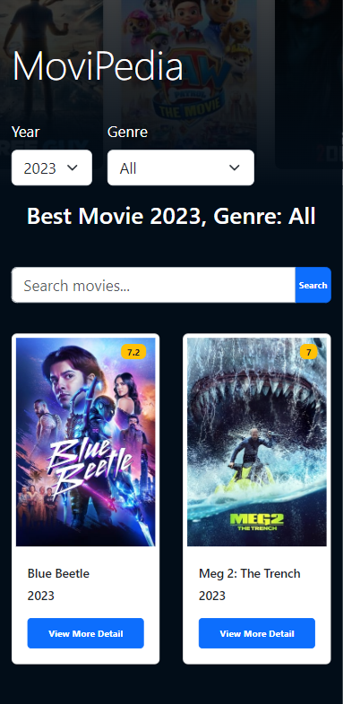

# Introduction

MoviPedia is a simple webpage for movie exploration that developed using the React framework. This page is designed for users to browse movies based on genre and year. Additionally, users can view more details of the movies, which are redirected to the TMDB website. This page was integrated with the public TMDB API to fetch real-time data, including the movie's title, release year, genre, description and rating. The development of this page served as the purpose of enhancing my familiarity with React components and gaining the knowledge about fetching data using an API.

# List of Features

- Browse movies by year or genre
- Search for movies using a text input
- Access movie details including title, release year, genre, rating and description
- Navigate to the TMDB webpage to explore additional information such as director, writer, actor/actress list, duration and other relevant details based on the selected movie

# System Interface

### Desktop View

<table>
  <tr>
    <td></td>
    <td></td>
  </tr>
 </table>

### Mobile View

<table>
  <tr>
    <td></td>
    <td></td>
  </tr>
 </table>

# System Testing

This page was tested using Katalon as an automation tool. There are 6 test cases representing different scenarios that were executed and all of them passed with a 100% success rate. The screenshots below show the output of the test case results

<table>
  <tr>
    <td></td>
  </tr>
 </table>

# Conclusion

In summary, MoviPedia is a simple movie exploration webpage built with React. It allows users to find movies by genre and year, providing details like titles, release years, genres, ratings and descriptions using the TMDB API. During development, I gained experience in React and data fetching via APIs. Other than that, I also able to understand on how to use Katalon as an automation tool for system testing.
